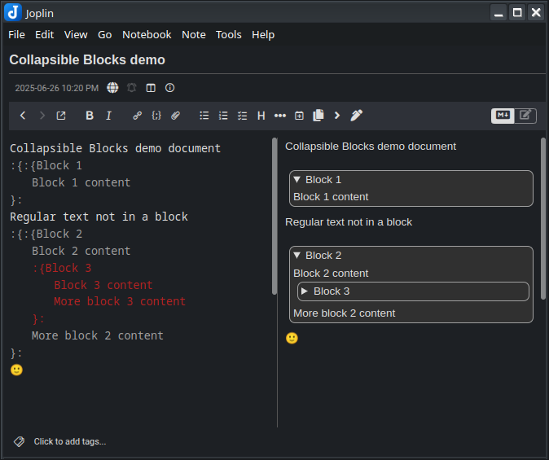
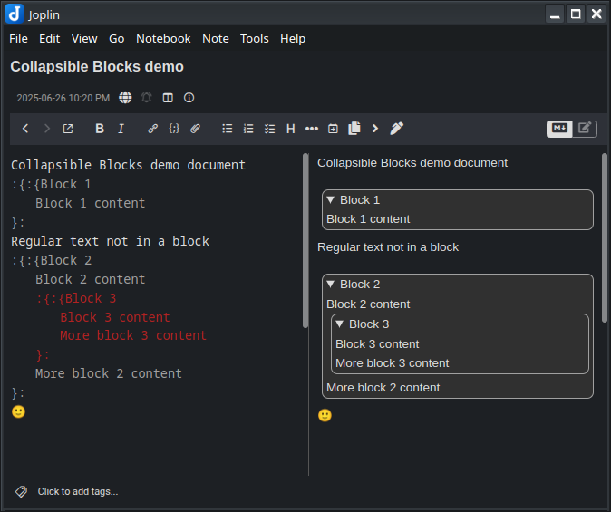
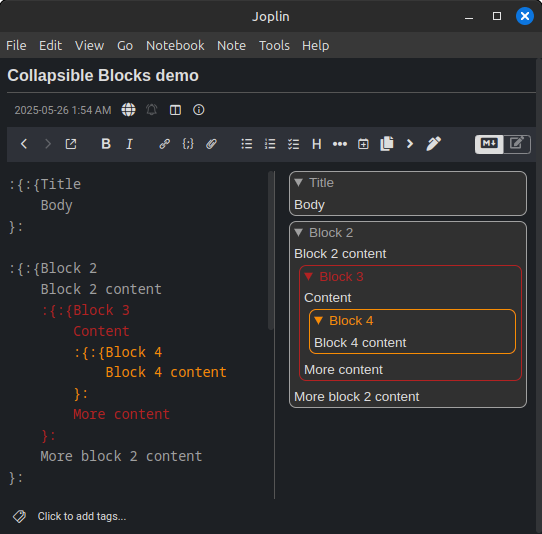

# Joplin Plugin - Collapsible block

This Joplin plugin allows you to create collapsible blocks with a title and extendable body. The blocks can be nested within each other, remember whether they were left open or closed, and color-coordinate between the editor and webview. 

Although the blocks this plugin creates are only collapsible in the webview, not the editor, it seems to pair well with the "Extra Markdown Editor Settings" plugin, which does allow for collapsing text in the editor, if "Enable code folding" is enabled in its settings. The collapsible blocks made by this plugin are detected by it as code, and are editor-foldable. If you're nesting collapsible blocks, only the outermost one (in the editor) will be foldable with this method. 

**Version**: 1.0

## Installation

- Open Joplin and navigate to `Preferences > Plugins`
- Search for `Collapsible blocks` and click install
- Restart Joplin

### Uninstall

- Open Joplin and navigate to `Tools > Options > Plugins`
- Search for `Collapsible block` plugin
- Press `Delete` to remove the plugin or `Disable` to disable it
- Restart Joplin

## Usage

### Collapsible block

In order to create a collapsible block, you can:
- press on the `Collapsible block` toolbar button to create a template collapsible, or
- highlight text then press on the `Collapsible block` toolbar button to convert it to a collapsible, or
- or manually type in the following format:

```
:{Block title
    Block body here
    And here
    And here...
}:
```

Nothing but whitespace may come before the `:{`. The title of the block must always appear on the same line as the `:{`. A title may be omitted. You can choose to put the `}:` on the same line as the last line of body text, or on its own line, but nothing is allowed to come after the `}:`. Indenting the body text is optional but recommended. In general, this plugin is designed to be extremely forgiving with how things are formatted and indented. The following examples (and more!) are all valid: 

**Examples**:
```
:{}:

:{
}:

:{Title}:

:{Title
}:

:{
Body}:

:{
Body
}:

:{
    Body
}:

:{Title
Body}:

:{Title
    Body}:

:{Title
Body
}:

:{Title
    Body
}:
```
(for readability, the last way is recommended)

Blocks will remember if you left them opened or closed. They will do so by editing the opener in the editor from :{ to :{:{ when opened, or back to :{ when closed. You may also do this manually. 

When nesting blocks within blocks, they will be color-coded in the editor, and may also be color-coded in the webview. These can both be controlled in the plugin Settings tab. 

## Screenshots

Three collapsibles, with one nested inside another, all closed


With the two outer ones opened



With all three opened



With a fourth one added, for three nesting levels, and webview colors enabled



## Custom styles

If you would like to style the collapsible blocks to your preference, use the following in your `userstyle.css` file, which can be accessed in `Joplin` → `Options` → `Appearance` → `Show Advanced Settings` → `Custom stylesheet for rendered Markdown`:

```css
/* Styling of the collapsible block */
details.cb-details {

}

/* Styling of the collapsible block title */
details.cb-details summary {

}

/* Below are used for styling nested collapsible blocks, and will only
be applied if "Do Webview Colors" is enabled in the plugin settings */

/* Styling of nested collapsible blocks - use n = 0-7 */
.cb-details.cb-nest-n {

}

/* Styling of nested collapsible block titles - use n = 0-7 */
.cb-details.cb-nest-n > summary {

}
```

## Settings
There is a settings page for the plugin in the Joplin options. There, you can customize the start and end tokens away from the default `:{` and `}:`, or enable/disable the color coding in the webview and editor. 

## Notes

- **There might be bugs**, [report them here](https://github.com/ntczkjfg/joplin-plugin-collapsible-block/issues) and I'll try to fix them if I can.

## Acknowledgement

Thanks to the creator of the [Joplin Spoilers](https://github.com/martinkorelic/joplin-plugin-spoilers) plugin, whose code helped me build this plugin. 