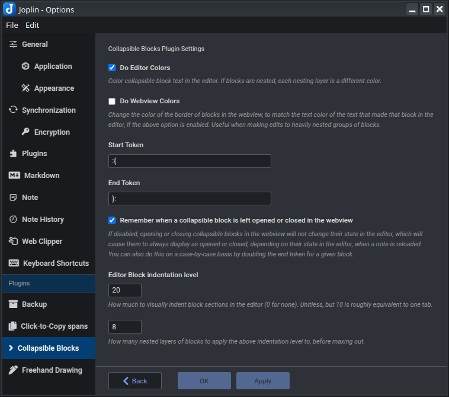
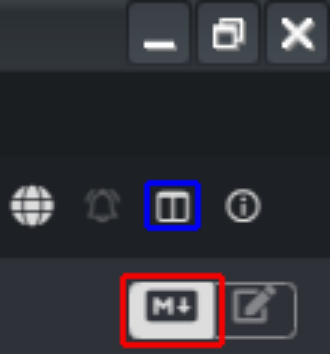

# Joplin Plugin - Collapsible Sections

This Joplin plugin allows you to create collapsible blocks with a title and extendable body. The blocks: 
* Can be nested within one another
* Remember if they were left opened or closed
* Can color-coordinate between the editor and webview
* Collapse in both the editor and the webview
* Support the use of markdown within them

Additionally, this plugin allows you to collapse headings within notes, in both the editor and the webview, with no additional syntax. 

There are many settings available to customize the desired features and behaviors. 

This plugin works on both Desktop and Mobile. 

**Version**: 1.9.1

### Installation

- Open Joplin and navigate to `Preferences > Plugins`
- Search for `Collapsible Sections` and click install
- Restart Joplin

### Uninstall

- Open Joplin and navigate to `Tools > Options > Plugins`
- Find the `Collapsible Sections` plugin
- Press `Delete` to remove the plugin, or click the toggle to disable it
- Restart Joplin

## Usage

### Collapsible blocks

In order to create a collapsible block, you can:
- press on the `Collapsible block` toolbar button to create a template collapsible, or
- highlight text then press on the `Collapsible block` toolbar button to convert it to a collapsible, or
- or manually type in the following format:

```
:{Block title
Block body here
And here
And here...
}:
```

Nothing but whitespace may come before the `:{`. The title of the block must always appear on the same line as the `:{`. A title may be omitted. You can choose to put the `}:` on the same line as the last line of body text, or on its own line, but nothing is allowed to come after the `}:`. In general, this plugin is designed to be extremely forgiving with how things are formatted and indented. The following examples (and more!) are all valid: 

**Examples**:
```
:{}:

:{
}:

:{

}:

:{Title}:

:{Title
}:

:{Title

}:

:{
Body}:

:{
Body
}:

:{Title
Body}:

:{Title
Body
}:
```
(for readability, the last way is recommended)

The text in the editor will use CSS to automatically indent blocks, based on how deeply nested the blocks are. This can be disabled or configured in the settings. 

Blocks will remember if you left them opened or closed. They will do so by editing the opener in the editor from `:{` to `:{:{` when opened, or back to `:{` when closed. You may also do this manually. 

If you don't want it to remember if you left a block opened or closed, you can turn this off globally in the plugin settings - or on a per-block basis by doubling the end token, from `}:` to `}:}:`. When you do this, you can still open and close the block in the webview, but they will not save their state in the editor - so the next time the note is loaded, they will be opened or closed again, depending on whether their opening token is `:{:{` or `:{`, respectively. So a block like `:{:{this}:}:` will always be initially open when you open a note, while a block like `:{this}:}:` will always be initially closed when you open a note. 

When nesting blocks within blocks, they can be color-coded in the editor, and may also be color-coded in the webview. These can both be controlled (enabled or disabled) in the plugin Settings tab. 

### Collapsible Headings

When you create headings within a note (by starting a line with `#`, `##`, `###`, `####`, `#####`, or `######`), this plugin automatically makes them collapsible, with no additional syntax required. This can be enabled or disabled in both the editor and the webview in settings. The collapsible region beneath a heading will extend to the next heading of equal or higher precedence. So, for example, a `#` heading will collapse to the next `#` heading, while a `###` heading will collapse to the next `#`, `##`, or `###` heading. Collapsible headings and collapsible blocks do play nicely with each other, and can be nested freely. 

Headings do remember if they should be left opened or closed (This can be disabled in settings). Due to the lack of special syntax, this is done by adding or removing a space from the end of the line with the heading. A heading with no space at the end is considered opened, while a heading with a space at the end is considered closed. For example:

```
# This heading does not end in a space, and so will render as opened when the note is loaded
This text will be visible when the note is loaded. 
# This heading does end in a space, and so will render as closed when the note is loaded 
This text will not be visible when the note is loaded. That is because there is a space ↑ here, after the word 'loaded', in the previous line. 
```

## Screenshots

Various headings and collapsible blocks, all open, with colors enabled


The same note, with some headings and blocks collapsed


## Settings
There is a settings page for the plugin in the Joplin options. There, you can:
* Enable or disable the color coding in the webview and editor
* Customize the start and end tokens away from the default `:{` and `}:`
* Globally disable the plugin's ability to remember if a collapsible block's opened/closed status was changed in the webview
* Disable automatic CSS indentation of collapsible block text in the editor, or configure it to indent more or 
* Enable or disable collapsing within the editor as well as the webview
* Toggle whether folding changes in one view automatically trigger folding changes in the other view
* Enable or disable header-based collapsing in the webview or editor
* Enable or disable remembering whether headers were left opened or closed



## Advanced

### Custom styles

If you would like to style the collapsible blocks to your preference, use the following in your `userstyle.css` file, which can be accessed in `Joplin` → `Tools` → `Options` → `Appearance` → `Show Advanced Settings` → `Custom stylesheet for rendered Markdown`:

```css
/* Styling of the collapsible block */
details.cb-details {

}

/* Styling of the collapsible block title */
details.cb-details summary {

}

/* Below are used for coloring nested collapsible blocks, and will
only be applied if colors are enabled in the plugin settings */
:root {
    --cb-color-0: #a0a0a0;
    --cb-color-1: #6b5fd6;  /* blue-violet */
    --cb-color-2: #2bb0e6;  /* bright cyan-blue */
    --cb-color-3: #6b5fd6;
    --cb-color-4: #2bb0e6;
    --cb-color-5: #6b5fd6;
    --cb-color-6: #2bb0e6;
    --cb-color-7: #6b5fd6;
}
```

## Troubleshooting
If the collapsible block is not showing up, or is showing up but you're unable to toggle it opened or closed, then you're likely accidentally in the Rich Text Editor, instead of the Markdown Editor. Joplin's Rich Text Editor does [not support most Markdown plugins](https://joplinapp.org/help/apps/rich_text_editor/#limitations). To enter the Markdown editor, look for the controls in the image below, in the upper right of Joplin. Make sure the Markdown/Rich Text toggle is on the left (red) side, and then use the blue button to swap between the editor and webview. 



## Issues

- **Encounter any bugs?** [Report them here](https://github.com/ntczkjfg/joplin-plugin-collapsible-block/issues), and I'll do my best to fix them.

## Acknowledgement

Thanks to the creator of the [Joplin Spoilers](https://github.com/martinkorelic/joplin-plugin-spoilers) plugin, whose code helped me build this plugin. Our code bases and methodologies are wildly different at this point, but it got me started with Joplin plugins. 

## Other plugins

Check out my other plugins:
* [Click-to-Copy Spans](https://github.com/ntczkjfg/joplin-plugin-click-to-copy-span)! Easily create spans of text that, when clicked, are automatically copied to your clipboard for fast and easy pasting. 
* [Hotstrings & Hotkeys]()https://github.com/ntczkjfg/joplin-plugin-hotstrings)! Easily create user-defined hotstrings and hotkeys for simple text insertion and replacement. 
