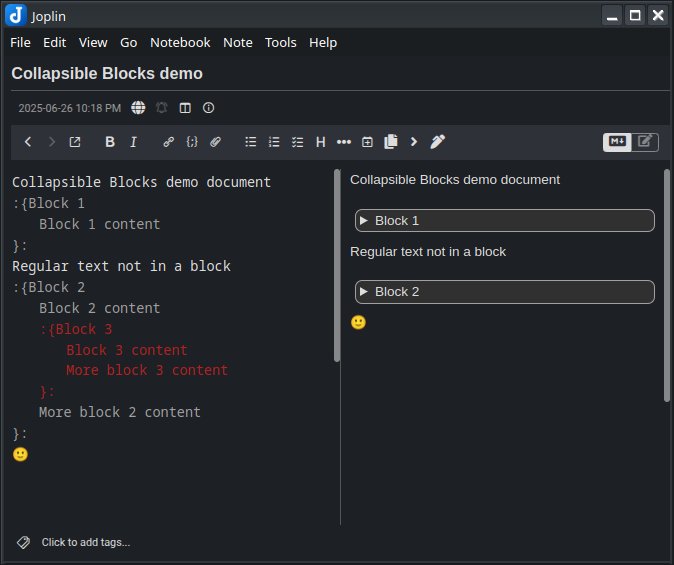
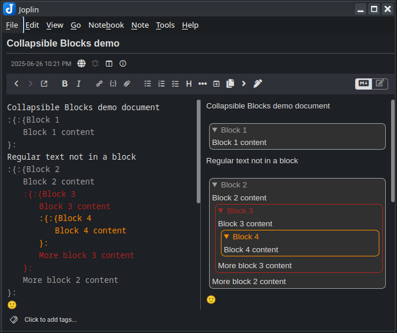

# Joplin Plugin - Collapsible blocks

This Joplin plugin allows you to create collapsible blocks with a title and extendable body. The blocks can be nested within each other, remember whether they were left open or closed, and color-coordinate between the editor and webview. 

Although the blocks this plugin creates are only collapsible in the webview, not the editor, it seems to pair well with the "Extra Markdown Editor Settings" plugin, which does allow for collapsing text in the editor, if "Enable code folding" is enabled in its settings. The collapsible blocks made by this plugin are detected by it as code, and are editor-foldable. If you're nesting collapsible blocks, only the outermost one (in the editor) will be foldable with this method. 

**Version**: 1.2.0

### Installation

- Open Joplin and navigate to `Preferences > Plugins`
- Search for `Collapsible blocks` and click install
- Restart Joplin

### Uninstall

- Open Joplin and navigate to `Tools > Options > Plugins`
- Find the `Collapsible blocks` plugin
- Press `Delete` to remove the plugin, or click the toggle to disable it
- Restart Joplin

## Usage

### Collapsible block

In order to create a collapsible block, you can:
- press on the `Collapsible block` toolbar button to create a template collapsible, or
- highlight text then press on the `Collapsible block` toolbar button to convert it to a collapsible, or
- or manually type in the following format:

```
:{Block title
Block body here
And here
And here...
}:
```

Nothing but whitespace may come before the `:{`. The title of the block must always appear on the same line as the `:{`. A title may be omitted. You can choose to put the `}:` on the same line as the last line of body text, or on its own line, but nothing is allowed to come after the `}:`. In general, this plugin is designed to be extremely forgiving with how things are formatted and indented. The following examples (and more!) are all valid: 

**Examples**:
```
:{}:

:{
}:

:{

}:

:{Title}:

:{Title
}:

:{Title

}:

:{
Body}:

:{
Body
}:

:{Title
Body}:

:{Title
Body
}:
```
(for readability, the last way is recommended)

The text in the editor will use CSS to automatically indent blocks, based on how deeply nested the blocks are. This can be disabled or configured in the settings. 

Blocks will remember if you left them opened or closed. They will do so by editing the opener in the editor from `:{` to `:{:{` when opened, or back to `:{` when closed. You may also do this manually. 

If you don't want it to remember if you left a block opened or closed, you can turn this off globally in the plugin settings - or on a per-block basis by doubling the end token, from `}:` to `}:}:`. When you do this, you can still open and close the block in the webview, but they will not save their state in the editor - so the next time the note is loaded, they will be opened or closed again, depending on whether their opening token is `:{:{` or `:{`, respectively. So a block like `:{:{this}:}:` will always be initially open when you open a note, while a block like `:{this}:}:` will always be initially closed when you open a note. 

When nesting blocks within blocks, they will be color-coded in the editor, and may also be color-coded in the webview. These can both be controlled (enabled or disabled) in the plugin Settings tab. 

## Screenshots

Three collapsibles, with one nested inside another, all closed



With the two outer ones opened


With all three opened


With a fourth one added, for three nesting levels, and webview colors enabled



## Settings
There is a settings page for the plugin in the Joplin options. There, you can:
* Customize the start and end tokens away from the default `:{` and `}:`
* Enable or disable the color coding in the webview and editor
* Globally disable the plugin's ability to remember if a collapsible block's opened/closed status was changed in the webview
* Disable automatic CSS indentation of collapsible block text in the editor, or configure it to indent more or less


## Advanced

### Custom styles

If you would like to style the collapsible blocks to your preference, use the following in your `userstyle.css` file, which can be accessed in `Joplin` → `Tools` → `Options` → `Appearance` → `Show Advanced Settings` → `Custom stylesheet for rendered Markdown`:

```css
/* Styling of the collapsible block */
details.cb-details {

}

/* Styling of the collapsible block title */
details.cb-details summary {

}

/* Below are used for styling nested collapsible blocks, and will only
be applied if "Do Webview Colors" is enabled in the plugin settings */

/* Styling of nested collapsible blocks - use n = 0-7 */
.cb-details.cb-nest-n {

}

/* Styling of nested collapsible block titles - use n = 0-7 */
.cb-details.cb-nest-n > summary {

}
```

## Troubleshooting
If the collapsible block is not showing up, or is showing up but you're unable to toggle it opened or closed, then you're likely accidentally in the Rich Text Editor, instead of the Markdown Editor. Joplin's Rich Text Editor does [not support most Markdown plugins](https://joplinapp.org/help/apps/rich_text_editor/#limitations). To enter the Markdown editor, look for the controls in the image below, in the upper right of Joplin. Make sure the Markdown/Rich Text toggle is on the left (red) side, and then use the blue button to swap between the editor and webview. 


## Issues

- **Encounter any bugs?** [Report them here](https://github.com/ntczkjfg/joplin-plugin-collapsible-block/issues), and I'll do my best to fix them.

## Acknowledgement

Thanks to the creator of the [Joplin Spoilers](https://github.com/martinkorelic/joplin-plugin-spoilers) plugin, whose code helped me build this plugin. Our code bases and methodologies are wildly different at this point, but it got me started with Joplin plugins. 

## Other plugins

Check out my other plugins:
* [Click-to-Copy Spans](https://github.com/ntczkjfg/joplin-plugin-click-to-copy-span)! Easily create spans of text that, when clicked, are automatically copied to your clipboard for fast and easy pasting. 
* [Hotstrings & Hotkeys]()https://github.com/ntczkjfg/joplin-plugin-hotstrings)! Easily create user-defined hotstrings and hotkeys for simple text insertion and replacement. 
